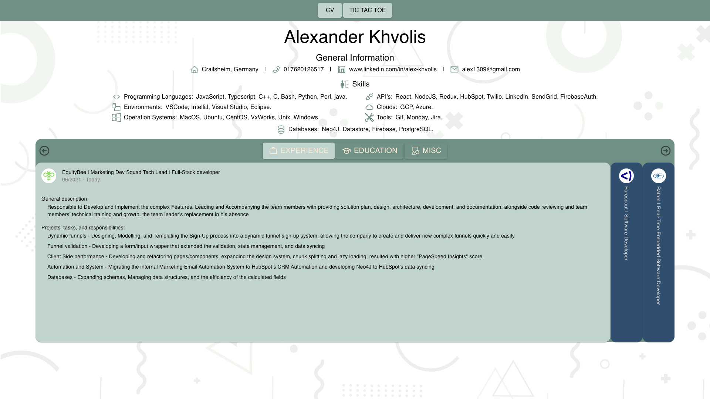

# Explium - Website

## About

My own website.

## Screenshot



## Prepare

```terminal
pnpm -F client install
```

## Run

```terminal
pnpm -F client start
```

## Dev

```terminal
pnpm -F client dev
```

## Build

```terminal
pnpm -F client build
```
